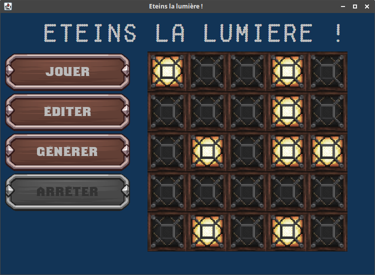

# Switch off the lights

A logic minigame which is easier to program than to play...

## How to play

Kinda easy : click any lamp to switch it on/off as well as the ones next by (left/top/right/bottom).
Will you be able to switch off all the lamps without switching on the others ? (May the chance be with you)

Generate or edit your level and play it !

